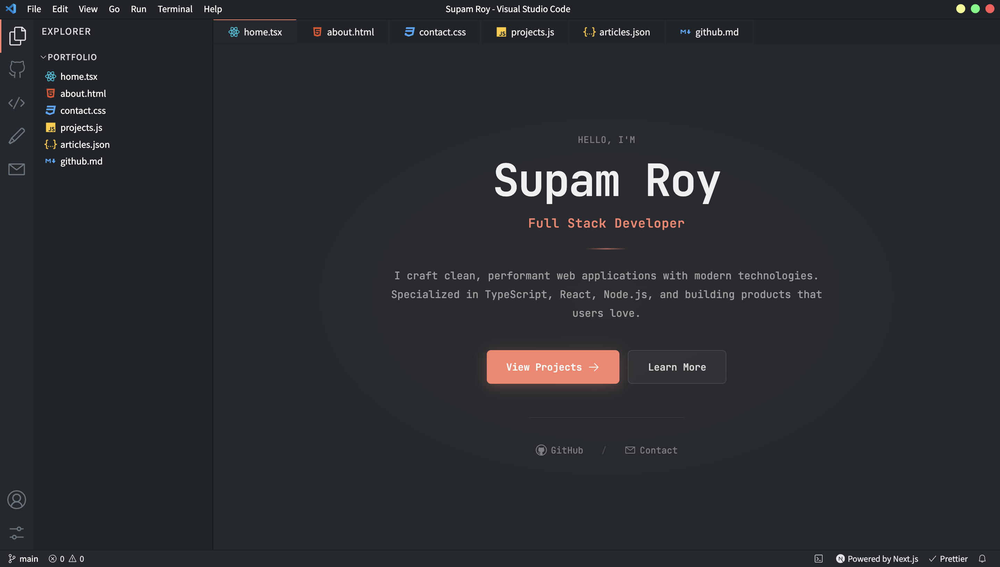

# 🧑‍💻 VSCode Portfolio Website

A stunning **Visual Studio Code themed developer portfolio** built with modern web technologies.  
It replicates the VSCode experience to showcase your work, skills, and background in a unique and interactive way.

---

## 🚀 Live Demo

🔗 https://portfolio-website-vueh.vercel.app/

---

## 📸 Preview

<p align="center">
  
</p>

---

## ✨ Features

- **VSCode UI Simulation**: An authentic reproduction of the VSCode interface including an activity bar, sidebar, editor tabs, and status bar.
- **Multiple Themes**: Change the look of the editor with built-in themes.
  - GitHub Dark (default)
  - Dracula
  - Ayu
  - Nord
- **Interactive Custom Terminal**: A fully functional simulated command-line interface where users can type commands to interact with the portfolio.
- **Dynamic Content Integration**:
  - **GitHub Stats**: Automatically fetches and visualizes your GitHub profile statistics and contribution calendar.
  - **Dev.to Articles**: Automatically pulls your latest blog posts from dev.to using their API.
- **Comprehensive Pages**: Includes sections for About, Projects, Articles, GitHub, Contact, and Settings.
- **Responsive Design**: Carefully crafted to look great on both desktop and mobile devices.

## 🚀 Tech Stack

- **Framework**: Next.js 15 (App Router)
- **Library**: React 19
- **Language**: TypeScript
- **Styling**: CSS Modules for scoped, maintainable styles
- **Icons**: `react-icons` (VSC Icon set)
- **Components**: `react-github-calendar` for visualizing contributions

## 💻 Getting Started

### Prerequisites

You need Node.js (version 18+ recommended) and npm/yarn/pnpm/bun installed on your machine.

### Installation

1. Clone the repository:
   ```bash
   git clone https://github.com/SUPAM07/PORTFOLIO-WEBSITE.git
   cd PORTFOLIO-WEBSITE
   ```

2. Install the dependencies:
   ```bash
   npm install
   # or
   yarn install
   # or
   pnpm install
   # or
   bun install
   ```

3. Set up environment variables:
   Create a `.env.local` file in the root directory. This is needed for fetching DEV.to articles and GitHub API data effectively.
   ```env
   # .env.local
   NEXT_PUBLIC_DEVTO_USERNAME=your_devto_username
   NEXT_PUBLIC_GITHUB_USERNAME=your_github_username
   # Optional GitHub Token to increase API rate limits
   GITHUB_API_TOKEN=your_personal_access_token
   ```

4. Start the development server:
   ```bash
   npm run dev
   ```

5. Open [http://localhost:3000](http://localhost:3000) with your browser to see the result.

## 📁 Project Structure

All VSCode UI related components can be found in the `components` folder. To change the content of the portfolio pages (like About, Contact), edit the files in the `app` directory according to the Next.js App Router conventions. 

For modifying the sidebar or tabs, check the respective components in the `components` directory. Data configurations (like list of projects) are usually located in the `data` directory.

## 🛠️ Customization

1. **Personal Information**: Update `data` files and page contents in the `app/` folder with your own details.
2. **Themes**: Add more themes by extending the CSS variables in the `styles` directory and adding the toggle option in the Settings component.
3. **Projects**: Edit the `app/projects/page.tsx` or related data file to list your own portfolio projects.

## 🤝 Contributing

Contributions, issues, and feature requests are welcome! Feel free to check the [issues page](https://github.com/SUPAM07/PORTFOLIO-WEBSITE/issues) for any open issues or to create a new one.

If you have suggestions for other features and themes, please open an issue.

## 📄 License

This project is licensed under the MIT License - see the [LICENSE](LICENSE) file for details.

## ☁️ Deployment

The easiest way to deploy this Next.js app is to use the [Vercel Platform](https://vercel.com/new). Check out the [Next.js deployment documentation](https://nextjs.org/docs/deployment) for more details.
