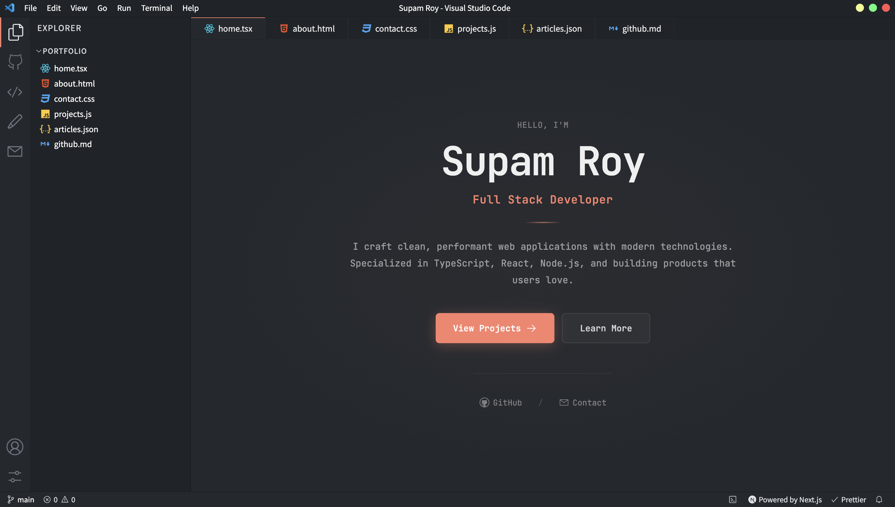

# 🧑‍💻 VSCode Developer Portfolio Website

[](https://nextjs.org/)
[](https://react.dev/)
[](https://www.typescriptlang.org/)
[](https://github.com/css-modules/css-modules)
[](https://vercel.com/)
[](LICENSE)

A highly interactive, developer-centric portfolio website themed after **Visual Studio Code**. Designed to showcase projects, experience, skills, and integrations (GitHub & DEV.to articles) inside a fully functional VS Code environment.

---

## 🚀 Live Demo

🌐 **Explore the live portfolio:** [portfolio-website-vueh.vercel.app](https://portfolio-website-vueh.vercel.app/)

---

## 📸 Preview

<p align="center">
  
</p>

---

## 🛠️ Key Architectural Features

1. **Exact UI Simulation**: Accurate replication of the Visual Studio Code interface layout including:
   - **Activity Bar**: Navigation options with interactive tooltips.
   - **Explorer Sidebar**: File tree structures replicating files like `home.tsx`, `about.html`, `contact.css`, `projects.js`, `articles.json`, and `github.md`.
   - **Editor Tabs**: Tab states matching the active route, supporting click-to-close and file-switching indicators.
   - **Simulated Terminal**: Interactive terminal console with a custom command interpreter.
   - **Status Bar**: Live stats (current branch, file encoding, line number tracking, theme status).
2. **Command Palette (`Cmd/Ctrl + Shift + P`)**:
   - A global overlay enabling keyboard-driven navigation, theme switching, terminal command executing, and search across files.
3. **Adaptive CSS Theme Engine**:
   - Utilizes vanilla CSS custom properties (variables) bound to a parent `html[data-theme]` attribute. Includes multiple premium editor themes:
     - **GitHub Dark** (Default)
     - **Dracula**
     - **Ayu**
     - **Nord**
4. **Dynamic API Integrations**:
   - **GitHub Analytics**: Integrates with the GitHub REST API to pull user repository statistics and showcases contribution heatmaps.
   - **Blogging Pipeline**: Dynamically queries the DEV.to API to pull and format published technical articles in real time.

---

## 📁 Project Directory Structure

```text
PORTFOLIO-WEBSITE/
├── app/                        # Next.js App Router (File-based Routing)
│   ├── about/                  # Bio, detailed experience, and skills grid
│   ├── articles/               # Fetches and renders DEV.to blog posts
│   ├── contact/                # Interactive contact form formatted as code
│   ├── github/                 # GitHub API contribution calendar & repository cards
│   ├── projects/               # Project listing cards grid
│   ├── layout.tsx              # Outer layout with Titlebar, Sidebar, and Bottombar
│   └── page.tsx                # Editor Homepage / welcome screen
├── assets/                     # Portfolio preview image assets
├── components/                 # Reusable React components
│   ├── layout/                 # Global UI (Titlebar, Sidebar, Explorer, Bottombar, Tabsbar)
│   ├── features/               # Core interactives (Terminal, CommandPalette, ContactCode)
│   └── ui/                     # UI components (ProjectCard, RepoCard, ArticleCard, SettingsPage)
├── data/                       # Config files for projects, links, and themes
├── lib/                        # Common logic, theme hooks, and helper functions
├── public/                     # Static assets (Favicons, logos, project screenshots)
├── styles/                     # CSS Modules scoped styling configurations
│   ├── globals.css             # Base styles, editor fonts, and root styling
│   └── themes.css              # Custom property maps for Drury/GitHub/Ayu/Nord
├── types/                      # TypeScript type interfaces
└── next.config.ts              # Next.js bundler configurations
```

---

## 💻 Simulating Terminal Reference

The portfolio includes a fully interactive terminal widget located at the bottom of the editor pane. It supports the following commands:

| Command | Usage | Description |
| :--- | :--- | :--- |
| `help` | `help` | Lists all available console commands. |
| `about` | `about` | Prints a brief bio of the developer. |
| `skills` | `skills` | Outputs developer stack proficiency categorized by languages and tools. |
| `projects`| `projects` | Lists the featured applications highlighted in the portfolio. |
| `contact` | `contact` | Prints social, GitHub, and email contact information. |
| `themes` | `themes` | Lists all loaded color themes. |
| `theme` | `theme <name>` | Programmatically changes the editor's theme (e.g. `theme dracula`). |
| `date` | `date` | Displays the current system date and timezone. |
| `whoami` | `whoami` | Prints the active user context profile. |
| `ls` | `ls` | Lists local mock directory structures. |
| `pwd` | `pwd` | Outputs the path of the current workspace directory. |
| `clear` | `clear` | Flushes the command history from the console window. |

---

## 🚀 Local Development Setup

### Prerequisites
- Node.js (Version 18.x or higher)
- npm, yarn, pnpm, or bun package manager

### Steps to Run Locally

1. **Clone the repository:**
   ```bash
   git clone https://github.com/SUPAM07/PORTFOLIO-WEBSITE.git
   cd PORTFOLIO-WEBSITE
   ```

2. **Install dependencies:**
   ```bash
   npm install
   ```

3. **Configure Environment Variables:**
   Create a `.env.local` file in the root directory and declare your social/API username credentials:
   ```env
   # .env.local
   NEXT_PUBLIC_DEVTO_USERNAME=your_devto_username
   NEXT_PUBLIC_GITHUB_USERNAME=your_github_username
   
   # Optional: GitHub personal access token to prevent API rate limiting
   GITHUB_API_TOKEN=your_personal_access_token
   ```

4. **Boot Up the Development Server:**
   ```bash
   npm run dev
   ```

5. **Access the application:**
   Open [http://localhost:3000](http://localhost:3000) in your web browser.

---

## 🛠️ Personalization & Customization

The portfolio is designed to be easily extensible. Follow these pathways to make it your own:

### 1. Customizing Personal Details
- **Projects**: Modify [data/projects.ts](file:///Users/supamroy/PORTFOLIO-WEBSITE/data/projects.ts) to change titles, descriptions, slugs, images, and source links. Add card covers to `public/project_img/`.
- **About/Bio/Skills**: Edit the sections directly in [app/about/page.tsx](file:///Users/supamroy/PORTFOLIO-WEBSITE/app/about/page.tsx).
- **Resume**: Save your resume PDF inside `public/resume/` named as `supam_cv.pdf` to link it automatically.

### 2. Adding Visual Custom Themes
1. Add new CSS variables definitions to [styles/themes.css](file:///Users/supamroy/PORTFOLIO-WEBSITE/styles/themes.css).
2. Append your theme key inside the `THEME_KEYS` array in [lib/themes.ts](file:///Users/supamroy/PORTFOLIO-WEBSITE/lib/themes.ts).
3. The application will dynamically populate it inside the theme dropdown lists, Command Palette, and Terminal.

---

## ☁️ Deployment

This project builds as a standard, optimized Next.js package and can be deployed with one-click to hosting networks like **Vercel** or **Netlify**:

[](https://vercel.com/new/clone?repository-url=https%3A%2F%2Fgithub.com%2FSUPAM07%2FPORTFOLIO-WEBSITE)

### Production Build Optimization
Compile and run the production server locally:
```bash
npm run build
npm run start
```

---

## 📄 License

Distributed under the MIT License. See [LICENSE](LICENSE) for more details.
